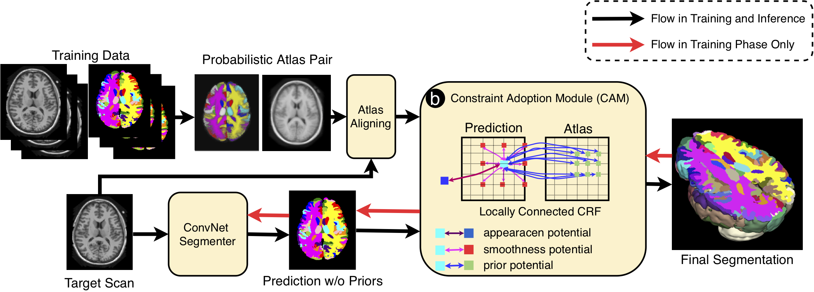

# Constraint Adoption Module (CAM) for incorporating ConvNets with Atlas Constraints

This repository contains Pytorch code for CAM: a method for incoperating ConvNets with atlas constraints for accurate and robust anatomical segmentation.  
The coinstraint boosts ConvNets for: (1) higher accuracy by reducing anatomical inconsistencies, and (2) better robustness to appearance variations. 

## Guide 

### 1. Atlas priors generation 
The method alleviates an atlas pair as the prior, which contains an atlas scan and a probablistic atlas label. 
The atlas pair can be derived from all avaiable annotations by registering/aligning to a common space, and summerizing with label fusion. 
We provide two examples of atlas pair, one from MICCAI2012 training dataset, and the other from IBSR training dataset. 
We applied syn registration for fine aligment, and simple averaging for summerization. 

<b>IBSR:</b> [Download Link](https://drive.google.com/drive/folders/1MXm4K3tpsk1yWZjyDkL8caZ-QEmDoJHI?usp=sharing) 
<b>MICCAI2012:</b> [Download Link](https://drive.google.com/drive/folders/1PL3c_dPLe5VqPo6r5Ej6nnGeMYgpiFDG?usp=sharing) 

### 2. Backbone ConvNet
The method relies on a backbone ConvNet for apperance-based potential of prediction. 
The ConvNet can be of any arthecture as long as is end-to-end trainable. 
In this code we use a toy ExampleNet as an example. 

### 3. Training 
The whole model, i.e. the backbone ConvNet with CAM plugged in, needs to be fine-tuned for the optimal performance.
The fusion weights reflects the impact of constraints, and will be optimized with the awareness of ConvNet's performance. 
Regular optmizer of Adam is applied in our experiments. 
An analysis about different potentials (prior potential, smoothness potential, and appearance potential) to the model robustness and accuracy is analysised. To be revealed in our paper.  

### 4. More details about algorithms to be revealed in our paper 

## Notes
1. The version of CAM using the spatial fusion weight (CAM_spatial.py) only supports batch_size_per_GPU == 1 in the current implementation.
Versions using scalar weight and categorical weights do not have such constraints. 
2. Current implementation works for 3D data only, while the method should also work for 2D data. 
3. The implementation is purly based on Pytorch without any other dependency.  
